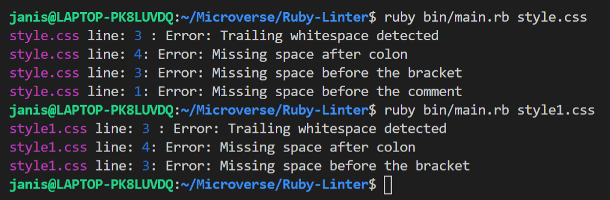

# Ruby-Linter
to run my linter after you clone it you will run this command on the terminal and then you put the file name

  

<h1 align="center">Ruby Linter</h1>

  <strong>Project created by Jenny Cárdenas</strong>
   
  This is a capstone project done at the end of the Ruby section of the Microverse technical curriculum.

  
   ‎ ‎ ‎ ‎
  

## ✅ About Ruby Linter ❎

This project is a basic linter for CSS files. 🤖The objective is to create a linter using the ruby language and test it using Rspec.

**Enjoy!!**

## Built With

- [Ruby ](https://www.ruby-lang.org/en/)
- Rubocop 🤖
- RSpec

## 🖥️ Getting Started

To get a local copy up and running follow these simple example steps.

### Prerequisites
Computer running Mac OS, Windows, or Linux Ubuntu.
Internet browser: Firefox, Google Chrome, Opera...

Have Ruby installed you can see this link for more detailed instructions [Install Ruby](https://www.theodinproject.com/courses/web-development-101/lessons/installing-ruby)

### Set up

- Clone this repository by running git clone https://github.com/janis-jenny/Ruby-Linter.git
- Navigate to the root directory

## 💭 Usage

### Overall description
This linter was created to work with CSS files inside the project folder and look for specific styling errors and will help your code to be more readable. 

### Type of linters
There are several types of checks performed by this linter, these are represented as individual linters internally. The internal linters implemented for the project are:
- **Trailing white space**: Checks for any spaces that are at the end of the line.
- **Space after a colon**: Checks for space after the colon at the value assignment for a property.
- **Space before an open bracket**: Checks for space before the opening bracket of a block code.
- **Comments**: Checks for a space after a comment starts and a space before a comment ends.

### Results
The results are presented to the user in the console with a line of text that indicates the files where the error was found along with the line number and the description of the error. The file name and the line number have a different color to help the user see better where the problem is.

### ⌨️ How to run the linter

To run the linter the user has to be inside the project root folder and then in the console type the following command:
> **$ ruby ./bin/main.rb {Filename}**

Where the {Filename} represents the optional parameter for checking a single file. The files to be checked can be anywhere inside the project folder, the linter will look for them automatically.

The linter will let you know what is going on and it has several errors that it can give.

## 🔎 Test Code with Rspec

RSpec is used for the test, to install the gem file, run:

> $ bundle install

But before that, make sure you have bundler installed in your system, else run: 

> $ gem install bundler

To be able to test your code with Rspec, just got to the project folder and run `rspec` in the terminal.

> $ rspec

**Enjoy my project!**

## 👥 Author

👤 **Jenny Cárdenas**

- GitHub: [@janis_jenny](https://github.com/janis-jenny)
- Twitter: [@janis_jenny](https://twitter.com/janis_jenny)
- LinkedIn: [Jenny Càrdenas](https://www.linkedin.com/in/paolajenny)

## 🤝 Contributing

Contributions, issues, and feature requests are welcome!

Feel free to check the [issues page](https://github.com/janis-jenny/Ruby-Linter/issues).

## ⭐ Show your support

Give a ⭐️ if you like this project!

## Acknowledgments

- Hat tip to anyone whose code was used
- Inspiration
- etc

## 📝 License

This project is [MIT](https://opensource.org/licenses/MIT) licensed.